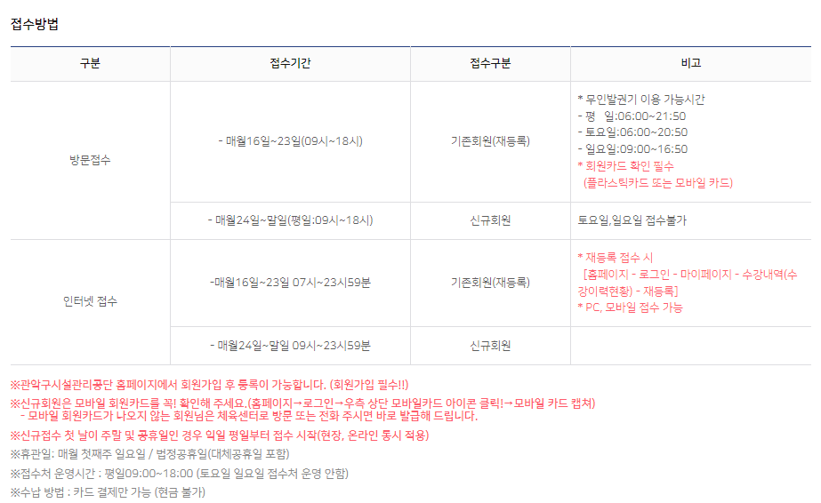
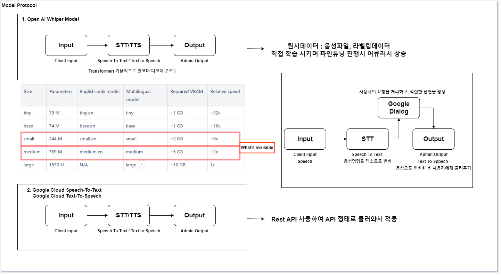
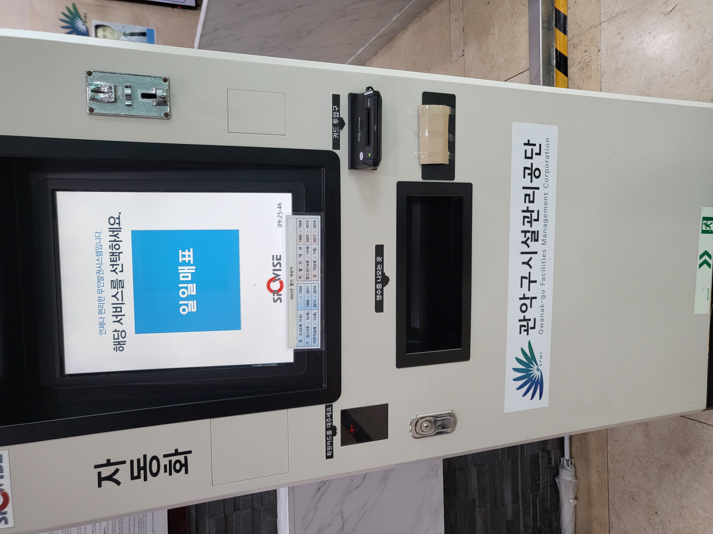
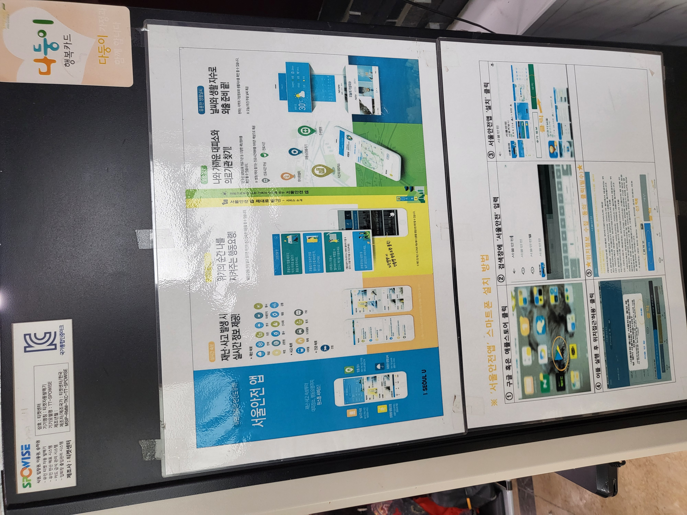
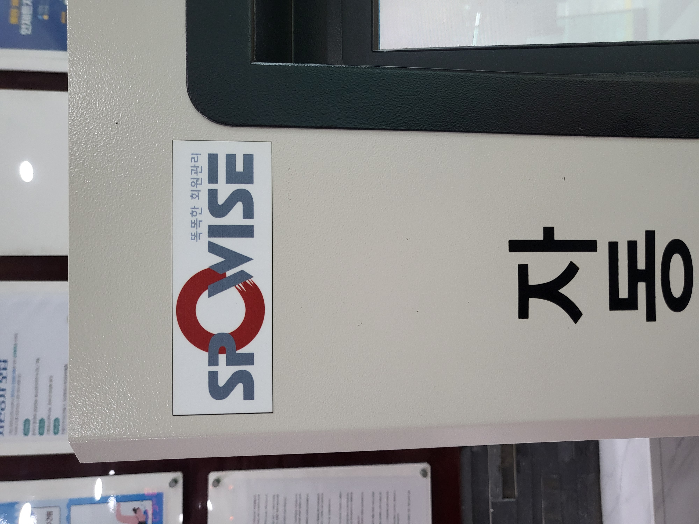

# 공공기관 음성인식 AI 모델 개발

진행상황: 진행중
날짜: 2024년 7월 2일
비고: 진헌님 기술 컨펌 대기 중 
제의자: 권기원

## 개요

- **배경 및 목적**
    - 획일화된 공공기관 업무를 음성인식 AI 솔루션을 활용할 수 있는 기기로 대체
        - 기기 입력이 아닌, 음성 인식 값으로 재등록/안내 플로우 처리
- **기대효과**
    - 기존 기기 활용(키오스크 터치)을 어려워하는 시니어 고객에게 음성으로 업무처리를 지원하며 편의성 증대
    - 인력감축 및 비용절감 효과
- **대상**
    - 50~80대 시니어 포함 공공기관 이용 고객
    - [신림체육센터](https://www.gwanakgongdan.or.kr/fmcs/26)
        - **신림체육센터 운영 프로그램(145개 클래스)**
            - 필요정보 : 프로그램명, 시간, 강습일, 대상, 강습료
            - 수영(94개 클래스)
                - 성인수영 15개 시간대 * 3개 레벨 → 45개클래스
                - 오전수영 5개 시간대 * 3개 레벨 → 15개 클래스
                - 오후수영 1개 시간대 * 3개 레벨 → 3개 클래스
                - 어린이수영 6개 시간대 * 3개 레벨 + 3개 클래스 → 21개 클래스
                - 영유아수영 1개 시간대 * 1개 레벨 → 1개 클래스
                - 자유수영 9개 시간대 * 1개 레벨 → 9개 클래스
            - 복합프로그램(21개 클래스)
                - 수영 21개 클래스
            - 헬스(3개 클래스)
                - 헬스 2개 클래스
                - 서킷트레이닝 1개 클래스
            - 에어로빅(3개 클래스)
            - 아쿠아로빅(8개 클래스)
            - 유치어린이교육(2개 클래스)
            - 문화/취미교육(14개 클래스)
                - 요가, 필라테스, 바디코어요가, 밸리댄스, 힙합방송댄스, 줌바댄스, SNPE

## 시나리오

- 사용자가 기관에 내방하여 AI 솔루션 탑재 기기에 다가와 필요한 사항을 음성으로 발화
- 음성 인식 후 상황에 맞게 처리
    - Speech - To - Speech (스피커 통해 음성안내)
    - Speech - To - Text (화면을 통해 텍스트 안내)
    - Speech - To - Speech/Text (동시 안내)
- **케이스 분류**
    - **프로그램 재등록 안내**
        - 음성인식 값 텍스트로 변환하여 입력 → 처리
            - 회원 구분 1 (등록/재등록)
            - 회원 구분 2 (기존/신규)
            - 종목 선택(수영/헬스 등)
            - 결제 단계
    
    
    
    - **프로그램 온/오프라인 접수 일정 안내**
        - 음성인식 값 텍스트로 변환하여 입력 → 처리
    - **프로그램 간단 정보 안내**
        - 음성인식 값 텍스트로 변환하여 입력 → 처리
    - **장소 안내**
        - 음성인식 값 텍스트로 변환하여 입력 → 처리
            - 센터 내 시설 안내
                - 화면 전환 (약도 팝업)
                    
                    
                    
                - 셔틀 운행 안내
                
                
                

## 기술파트

- **기본**
    
    **음성 인식 (Speech Recognition)**
    
    - **Google Cloud Speech-to-Text**: 구글의 음성 인식 API로, 다양한 언어와 방언을 지원하며 실시간 음성 인식을 제공
    - **Microsoft Azure Speech Service**: 마이크로소프트의 음성 인식 서비스로, 정확한 음성 인식과 다양한 언어 지원을 제공
    - **~~IBM Watson Speech to Text~~**: IBM의 음성 인식 서비스로, 정확한 음성 인식 기능과 커스터마이징 옵션을 제공
    - **Naver Clova Speech Recognition :** 네이버의 음성 인식 서비스로, 한국어에 특화
    - **Open AI Whisper** : Chat-GPT 회사의 음성인식 모델, 한국어 서비스에 특화
    
    **음성 합성 (Text-to-Speech)**
    
    - **Google Cloud Text-to-Speech**: 구글의 텍스트를 자연스러운 음성으로 변환하는 서비스로, 다양한 언어와 음성을 지원
    - **~~Amazon Polly~~**: 아마존의 텍스트를 음성으로 변환하는 서비스로, 여러 언어와 음성, 감정 표현 옵션을 제공
    - **Microsoft Azure Text-to-Speech**: 마이크로소프트의 음성 합성 서비스로, 자연스러운 음성과 다양한 언어 지원을 제공
    - **Naver Clova Text-to-Speech :** 네이버의 음성 합성 서비스로, 한국어에 최적화
    - **Open AI Whisper** : Chat-GPT 회사의 음성인식 모델, 한국어 서비스에 특화
    
    **대화형 AI (Conversational AI)**
    
    - **Google Dialogflow**: 구글의 대화형 AI 플랫폼으로, 자연어 처리를 통해 사용자와 상호작용할 수 있는 대화형 인터페이스를 구축
    - **Microsoft Bot Framework**: 마이크로소프트의 대화형 AI 플랫폼으로, 다양한 채널에서 사용할 수 있는 봇을 만들기 가능
    - **~~IBM Watson Assistant~~**: IBM의 대화형 AI 플랫폼으로, 사용자와 자연스럽게 상호작용할 수 있는 봇을 만들기 가능
    - **Naver Clova Chatbot :** 네이버의 대화형 AI 서비스로, 한국어에 최적화
    
    **통합 솔루션**
    
    - **Google Cloud AI Platform**: 음성 인식, 음성 합성, 자연어 처리 등을 통합적으로 제공하는 구글의 AI 플랫폼
    - **~~Microsoft Azure AI~~**: 음성 인식, 음성 합성, 자연어 처리 등을 통합적으로 제공하는 마이크로소프트의 AI 플랫폼
    - **~~IBM Watson AI~~**: 음성 인식, 음성 합성, 자연어 처리 등을 통합적으로 제공하는 IBM의 AI 플랫폼
    - **Naver Clova AI Platform :** 한국어에 특화된 다양한 AI 서비스를 제공하며, 음성 인식, 음성 합성, 대화형 AI 등의 기능을 통합적으로 이용
    
    **예시 시나리오**
    
    1. **사용자 인식 및 안내**:
    - 사용자가 키오스크에 접근하면 Google Cloud Text-to-Speech를 사용하여 "안녕하세요, 무엇을 도와드릴까요?"라고 안내
    1. **음성 명령 인식**:
    - 사용자가 음성으로 요청을 하면 Google Cloud Speech-to-Text를 사용하여 음성 명령을 텍스트로 변환
    1. **대화형 인터페이스**:
    - 변환된 텍스트를 Google Dialogflow에 전달하여 사용자의 요청을 처리하고, 적절한 답변을 생성
    1. **음성 응답 제공**:
    - 생성된 답변을 Google Cloud Text-to-Speech를 사용하여 음성으로 변환한 후 사용자에게 들려주기
- 활용 데이터
    - [명령어 음성 데이터](https://www.aihub.or.kr/aihubdata/data/view.do?currMenu=115&topMenu=100&aihubDataSe=data&dataSetSn=94)(노인) 中 키오스크 명령 데이터
    - [저음질 전화명 음성인식 데이터](https://www.aihub.or.kr/aihubdata/data/view.do?currMenu=115&topMenu=100&dataSetSn=571)
- 활용 기술

[newPJ.drawio](newPJ.drawio)

- 프론트엔드 개발
    - Tailwind CSS 스킨
    - 우선 웹뷰 or 앱뷰 형식

**모든 파일 저장과 코드 실행은 원격서버(211.216.177.2) 및 구글 드라이브에서 이뤄집니다.**

**진행사항 (~07/08)**

### 1. `multi_response_STT.ipynb`

- **기능**: 비언어적 표현인 '음', '그', '어'의 WAV 데이터를 이용하여 각 표현을 구분하는 다중 분류 모델을 학습하고 저장합니다.
- **주요 단계**:
    - 필요한 라이브러리와 Google Drive를 마운트합니다.
    - 학습 및 테스트 데이터셋의 경로 설정 후, 데이터 로딩과 MFCCs 특징 추출을 진행합니다.
    - 모델은 LSTM, GRU, Conv2D를 포함한 딥러닝 구조를 사용하며, 결과적으로 모델을 학습시키고 결과를 저장합니다.
    - `model.save()`를 통해 모델을 `.h5` 형식으로 저장합니다.

### 2. `binary_nonverbal_STT.ipynb`

- **기능**: 입력된 음성이 비언어적 표현인지 아닌지를 판별하는 이진 분류 모델을 생성하고 저장합니다.
- **주요 단계**:
    - 음성 데이터를 로드하고, 특징을 추출하여 라벨링된 데이터로 이진 분류 모델 학습을 준비합니다.
    - 비언어적 표현을 1로, 그 외는 0으로 라벨링합니다.
    - 여러 딥러닝 기반 아키텍처(예: LSTM, GRU)를 통해 모델을 학습시키고, 이진 분류를 수행합니다.
    - `model.save()`를 통해 학습된 모델을 `.h5` 형식으로 저장합니다.

### 3. `STT_1.ipynb`

- **기능**: 앞서 저장된 `multi_STT`와 `binary_STT`의 모델을 로드하여 사용하고, 실제 음성에서 비언어적 표현과 언어적 표현을 구분하여 처리합니다.
- **주요 단계**:
    - 로드된 모델을 사용하여 입력된 음성 데이터에서 비언어적 표현을 감지하고 구분합니다.
    - 비언어적 표현이 아닌 부분은 STT(Speech-to-Text) 기술을 이용하여 텍스트로 변환합니다.
    - 구글 클라우드 STT 및 OpenAI의 Whisper 모델을 사용한 예시가 포함되어 있으며, 최종적으로 음성 데이터를 텍스트로 변환하고 분석 결과를 출력합니다.

[STT 모델 및 API 적용 후 간소화 한 사이트](http://localhost:5173/).demo

<aside>
💡 💥주의💥
**Server** :  API 호출 코드 실행 후
**Client** : yarn dev로 사이트 코드 실행 후 확인

</aside>

---

## 레퍼런스

- **레퍼런스**
    - 미디어
        - AI 음성인식 키오스크([https://www.100news.kr/51603](https://www.100news.kr/51603))
        - 추모공원 음성인식 키오스크([https://www.pressian.com/pages/articles/2024062511083094248](https://www.pressian.com/pages/articles/2024062511083094248))
        - 시니어대상 음성인식 AI 다솜이([https://www.naeponews.co.kr/news/articleView.html?idxno=11284](https://www.naeponews.co.kr/news/articleView.html?idxno=11284))
        - AI 음성인식 주문 키오스크 ([https://blog.naver.com/song_ceo/223202966585](https://blog.naver.com/song_ceo/223202966585))
        - https://www.youtube.com/watch?v=mxrYl0jWMds
        - https://www.youtube.com/watch?v=SRU2WvZN4as
        - https://www.youtube.com/watch?v=i7EyWN313lQ
    
    - 충북음성반다비국민체육센터([https://blog.naver.com/gn7799/223325535299](https://blog.naver.com/gn7799/223325535299))
        
        
        
    - **회사**
        - 엘젠([http://elgen.ai/gnuboard5/](http://elgen.ai/gnuboard5/))
        - 브로드씨앤에스([http://www.broadcns.com/](http://www.broadcns.com/))
            - ([https://blog.naver.com/broadcns2013/223261212941](https://blog.naver.com/broadcns2013/223261212941))
    - **서울신림체육센터**
        - 관리기업 : [혁산정보시스템 SPOWISE](https://www.hisco.co.kr/)
    
    
    
    
    
    
    
